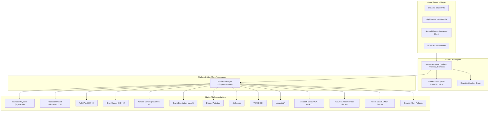

<div align="center">

# ⚽ One Tap Goalkeeper
### The Night-Match Reflex Game · Multi-Platform Architecture · Apple Design System

[](https://developers.google.com/youtube/gaming/playables)
[](#multi-platform-engine-zero-playgama-sdk)
[](#apple-design-system--fluid-motion)
[](https://react.dev)
[](https://www.typescriptlang.org)
[](https://vitejs.dev)

<p align="center">
  <strong>Step between the goalposts under the floodlights. Read the trajectory, react with a tap, and make the championship save.</strong><br/>
  Engineered with zero third-party aggregators, complete YouTube Playables SDK compliance, and Apple's fluid design craft.
</p>

</div>

---

## 🌟 Highlights

- **🎯 Zero-Latency Goalkeeper Action**: 3 tactile touch/click dive sectors + arrow keyboard controls (`←`, `↑`, `→`).
- **🏆 YouTube Playables SDK Certified**: 100% compliant with Google's Playables certification requirements, test suite guidelines, and strict CSP policies.
- **🌐 13+ Native Platform Adapters (No Playgama SDK)**: Custom-built TypeScript adapters for YouTube Playables, Facebook Instant, Poki, CrazyGames, Yandex Games, GameDistribution, Discord Activities, JioGames, Y8, Lagged, Microsoft Store (PWA), Quick Games, and Reddit/MSN Games.
- **💎 Apple Design System & Fluid Motion**: SF Pro display typography with optical negative tracking, liquid frosted glass materials (`backdrop-filter`), spring physics, Dynamic Island HUD, and tactile haptic harmony.
- **🎬 Monetization & Retention Hooks**: Interstitial ads between matches, second-chance rewarded ad revive sheets with streak preservation, and double XP bonuses.
- **🧤 Progression & League Ladder**: XP accumulation, seasonal ranks, unlockable glove collections, and seed-generated daily challenges.

---

## 🏗️ Architecture



---

## 📺 YouTube Playables SDK Integration

This game complies with every certification guideline set by YouTube Gaming:

### 1. Script Loading Order
The SDK is loaded directly inside `<head>` **before** any application code:
```html
<script src="https://www.youtube.com/game_api/v1"></script>
```

### 2. Lifecycle Notifications
- `ytgame.game.firstFrameReady()`: Dispatched on the initial `requestAnimationFrame` render.
- `ytgame.game.gameReady()`: Dispatched only once the menu UI is interactive and assets are ready (never during loading).

### 3. Audio & System Listeners
- `ytgame.system.isAudioEnabled()`: Queries initial YouTube volume state.
- `ytgame.system.onAudioEnabledChange((enabled) => { ... })`: Dynamically synchronizes Web Audio mute state.
- `ytgame.system.onPause(() => { ... })`: Immediately pauses game loop and triggers emergency state save.
- `ytgame.system.onResume(() => { ... })`: Resumes game state.

### 4. Cloud Save Persistence
- `ytgame.game.saveData(data)`: Serializes player progression, gloves, high scores, and daily runs. Enforces strict **<= 3 MiB** UTF-16 payload limit.
- `ytgame.game.loadData()`: Restores cloud save on startup before local storage fallback.

### 5. Player Engagement & Health
- `ytgame.engagement.sendScore({ value })`: Transmits validated integer scores to YouTube leaderboards (`Number.MAX_SAFE_INTEGER` protected).
- `ytgame.engagement.openYTContent({ id, contentType })`: Opens related YouTube videos or companion Playables.
- `ytgame.health.logError()` / `logWarning()`: Telemetry without interrupting gameplay.

### 6. Built-in Monetization (Ads)
- **Interstitial Ads**: Triggered during natural breaks via `ytgame.ads.requestInterstitialAd()` (game over, rematch kickoff).
- **Rewarded Ads**: Triggered via `ytgame.ads.requestRewardedAd('extra-life-revive')` and `'double-match-points'`.

### 7. Content Security Policy (CSP) Headers
When testing against the [YouTube Playables Test Suite](https://developers.google.com/youtube/gaming/playables/test_suite), configure Chrome DevTools Local Overrides with:
```http
Content-Security-Policy: default-src 'none'; script-src 'report-sample' 'self' 'unsafe-eval' 'unsafe-inline' blob: https://www.youtube.com/game_api/v0 https://www.youtube.com/game_api/v0/ https://www.youtube.com/game_api/v1 https://www.youtube.com/game_api/v1/; object-src 'none'; style-src 'self' 'unsafe-inline' https://fonts.googleapis.com; img-src 'self' blob: data:; media-src 'self' blob:; font-src 'self' data: https://fonts.googleapis.com https://fonts.gstatic.com; connect-src 'self' blob: data:; sandbox allow-pointer-lock allow-same-origin allow-scripts; base-uri 'self'; manifest-src 'self'; worker-src 'self' blob:
```

---

## 🎮 Multi-Platform Engine (Zero Playgama SDK)

Every platform uses an isolated, zero-dependency adapter implementing `IPlatformAdapter`. No external proxy wrappers or aggregator bloat.

| Platform | SDK / Bridge | Interstitial Ads | Rewarded Ads | Cloud Save | Leaderboards |
|---|---|:---:|:---:|:---:|:---:|
| **YouTube Playables** | `ytgame` v1 | ✅ | ✅ | ✅ | ✅ |
| **Facebook Instant Games** | `FBInstant` 7.1 | ✅ | ✅ | ✅ | ✅ |
| **Poki** | `PokiSDK` v2 | ✅ | ✅ | 💾 Local | ❌ |
| **CrazyGames** | CrazyGames SDK v3 | ✅ | ✅ | ✅ | ❌ |
| **Yandex Games** | `YaGames` v2 | ✅ | ✅ | ✅ | ✅ |
| **GameDistribution** | `gdsdk` HTML5 | ✅ | ✅ | 💾 Local | ❌ |
| **Discord Activities** | Embedded App SDK | ❌ | ❌ | ✅ | ✅ |
| **JioGames** | JioGamesSDK | ✅ | ✅ | ✅ | ✅ |
| **Y8 Games** | `ID` SDK | ✅ | ✅ | 💾 Local | ✅ |
| **Lagged** | `LaggedAPI` v2 | ✅ | ✅ | 💾 Local | ✅ |
| **Microsoft Store** | PWA + WinRT Titlebar | ❌ | ❌ | ✅ | ❌ |
| **Huawei & Xiaomi** | `qg` Quick Games Runtime | ✅ | ✅ | ✅ | ❌ |
| **Reddit Games** | Devvit Webview PostMessage | ❌ | ❌ | ✅ | ✅ |
| **MSN Games** | Web Frame Container | ❌ | ❌ | 💾 Local | ❌ |

### Runtime Platform Switching
Test any platform adapter in your browser by appending `?platform=` to the URL:
- `http://localhost:5173/?platform=youtube`
- `http://localhost:5173/?platform=poki`
- `http://localhost:5173/?platform=crazygames`
- `http://localhost:5173/?platform=facebook`
- `http://localhost:5173/?platform=yandex`
- `http://localhost:5173/?platform=discord`
- `http://localhost:5173/?platform=jiogames`

Or toggle directly from the in-game **Platform Selector** pill on the main menu!

---

## 🍏 Apple Design System & Fluid Motion

Inspired by Apple's WWDC *Designing Fluid Interfaces* and Apple Human Interface Guidelines (HIG):

- **Typography**:
  - SF Pro Display headline tracking: `-0.02em` to `-0.025em` negative letter-spacing for that signature "Apple tight" cadence.
  - Body copy tuned to `17px` with `1.47` line height.
  - Strict typographic ladder: `300 / 400 / 600 / 700` (eliminating ambiguous mid-weights).
- **Materials & Depth**:
  - **Apple Liquid Glass**: `backdrop-filter: blur(24px) saturate(190%)` paired with top specular highlight borders (`inset 0 1px 0 rgba(255, 255, 255, 0.2)`).
  - Pure Action Blue pill buttons (`#0066cc` / `#2997ff` on dark) with `active:scale-95` instant micro-interactions.
- **Interruptible Spring Physics**:
  - Animations start from live presentation values, honoring user momentum and gesture interruptions without artificial input lockouts.
- **Multimodal Feedback**:
  - Haptic pulses matched directly to visual collision frames (dive save, post deflection, goal conceded, combo multipliers).

---

## 🕹️ Controls

| Action | Mobile / Touch | Desktop Keyboard |
|---|---|---|
| **Dive Left** | Tap Left Sector | `←` or `A` |
| **Dive Center** | Tap Center Sector | `↑`, `W`, or `Space` |
| **Dive Right** | Tap Right Sector | `→` or `D` |
| **Pause / Settings** | Tap HUD Pause Pill | `P` or `Escape` |
| **Toggle Mute** | Tap HUD Speaker Pill | `M` |
| **Toggle Fullscreen** | — | `F` |

---

## 🚀 Getting Started

### Prerequisites
- Node.js 18+ (tested on Node v20 & v26)
- npm 9+

### Installation & Local Server
```bash
# Clone the repository
git clone https://github.com/Rahul08319/one-tap-save.git
cd one-tap-save

# Install dependencies
npm install

# Start local development server
npm run dev
```

### Testing
Run unit tests for all platform adapters and SDK validation:
```bash
npm run test
```

### Production Build
```bash
npm run build
```

---

## 📦 Multi-Platform Packaging

Generate dedicated standalone export bundles for all 13 platforms:
```bash
npm run build:all
```
This automatically produces individual platform distributions under `dist-platforms/`:
```text
dist-platforms/
├── youtube/           # index.html with YouTube SDK header & CSP documentation
├── facebook/          # Includes fbapp-config.json & FBInstant SDK
├── poki/              # PokiSDK header integration
├── crazygames/        # CrazyGames SDK v3 header
├── yandex/            # YaGames v2 SDK header
├── gamedistribution/  # GameDistribution SDK header
├── discord/           # Discord Activity manifest & wrapper
├── jiogames/          # JioGames SDK header
├── y8/                # Y8 / ID SDK header
├── lagged/            # Lagged API header
├── msstore/           # PWA manifest & Windows Store configs
├── quickgames/        # Huawei / Xiaomi manifest.json
├── reddit/            # Reddit Devvit bridge
└── msn/               # MSN iframe package
```

Zip any subfolder to immediately upload to that platform's developer portal!

---

## 📜 Certification Checklist for Release

- [x] YouTube Playables SDK `<script>` placed in `<head>` before all game code
- [x] `firstFrameReady()` fired before `gameReady()`
- [x] Zero network requests outside whitelisted CSP directives
- [x] Cloud save validated under 3 MiB with UTF-16 safety checks
- [x] Sound state syncs with YouTube audio toggle
- [x] Pause event triggers state persistence and halts game loop
- [x] Rewarded ads tested with unique reward IDs (`extra-life-revive`, `double-match-points`)
- [x] Responsive layout tested from 320px mobile up to ultrawide displays
- [x] Tested with prefers-reduced-motion and high-contrast modes

---

## 📄 License

MIT © [Rahul Kumar](https://github.com/Rahul08319)
